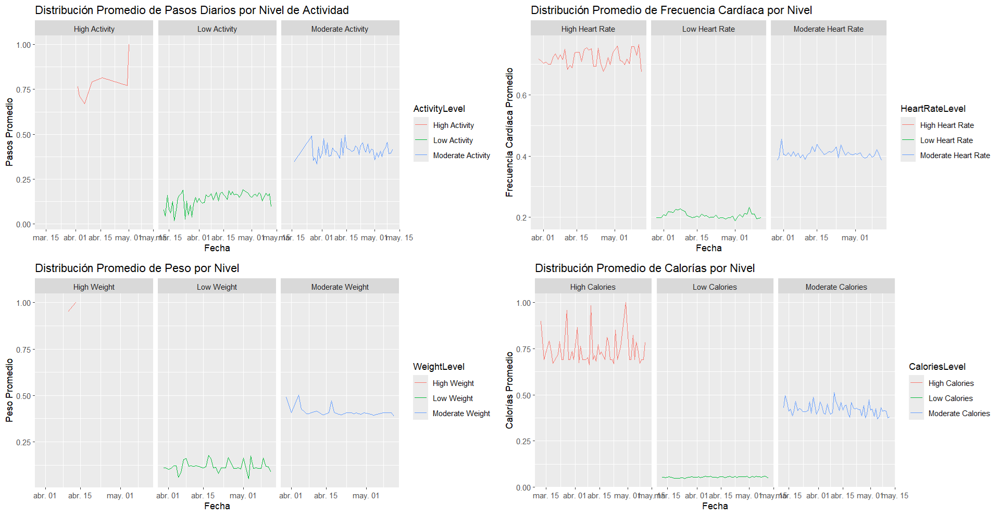
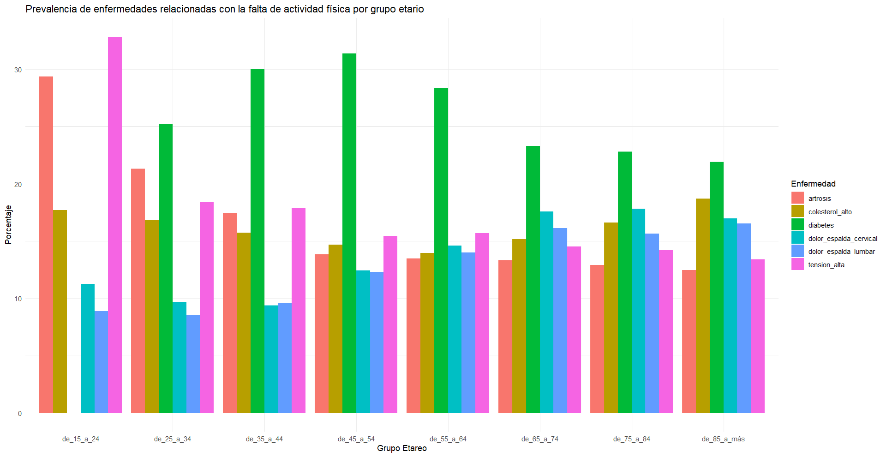

# Portafolio de Análisis de Datos

Bienvenido a mi portafolio de análisis de datos. Aquí presento algunos de los proyectos en los que he trabajado.

## Estructura del Proyecto

`code/`: Contiene los archivos RMarkdown y scripts R.
  - `notebooks/`: R Markdown files con análisis detallado.
  - `scripts/`: R scripts utilizados para procesamiento y análisis de datos.
- `data/`: Contiene los datos sin procesar y procesados.
  - `Fitbit/`: Contiene datos de Fitbit.
    - `raw/`: Datos originales.
    - `processed/`: Datos procesados.
  - `minsa/`: Contiene datos de MINSA.
    - `raw/`: Datos originales.
    - `output/`: Contiene los archivos de resultados en formato RDS.
- `images/`: Contiene las imágenes generadas por los análisis.
- `reports/`: Contiene los informes HTML y PDF generados.
- `README.md`: Este archivo, que proporciona una descripción general del proyecto.

## Proyectos

### Análisis de Datos de Fitbit

- **Descripción**: Análisis de datos de actividad física, frecuencia cardíaca y peso registrados por dispositivos Fitbit.
- **Archivos**:
  -  [Fibit RMarkdown](./Abesan7411/Abesan7411.github.io/code/notebooks/fitbit_correlacion_y_regresion.Rmd)

    - [Fitbit análisis estadistico PDF](./Abesan7411/Abesan7411.github.io/report/fitbit_correlacion_y_regresion.pdf)

### Análisis de Datos del MINSA

- **Descripción**: Análisis de datos proporcionados por el MINSA sobre la percepción de salud, enfermedades crónicas y nivel de actividad física.
- **Archivos**:
  - [Minsa RMarkdown](./Abesan7411/Abesan7411.github.io/code/notebooks/minsa_analisis_correlacion.Rmd)

    - [Minsa análisis estadistico PDF](./Abesan7411/Abesan7411.github.io/report/minsa_analisis_correlacions.pdf)

## Datos

- **Fitbit**: Datos de actividad física recopilados entre marzo y mayo de 2016.
  - [Datos Fitbit](./Abesan7411/Abesan7411.github.io/data/Fitbit/raw/)
  - [Datos Fitbit Procesados](.Abesan7411/Abesan7411.github.io/data/Fitbit/Processed_Files/)
- **MINSA**: Datos de la encuesta de salud realizada en 2017.
  - [Datos MINSA](.Abesan7411/Abesan7411.github.io/data/minsa/raw/)

 
## Resultados Visuales

- **Visualización de los datos de Fitbit**:
  - 
  - 

- **Visualización de los datos del MINSA**:
  - 
  - 
  - 
  - 

### Resumen Ejecutivo

## Introducción:
En este informe se presentan los resultados de dos análisis de datos distintos: uno enfocado en los datos de actividad física recopilados por dispositivos Fitbit y otro en los datos proporcionados por el MINSA. Ambos análisis buscan extraer insights valiosos para la toma de decisiones informadas.

## Metodología
Para el uso de los datos de Fitbit y el MINSA, se partió del escenario supuesto en el momento de que se realizó el análisis, esto vendría a ser en setiembre 2019, fecha en que la gerencia de Bellabeat disponía del marco de datos. El primero es una recopilación de los datos que da el App de FitBit mediante el uso de su pulsera, los datos abarcan 2 meses entre marzo y mayo 2016, y el segundo es un extracto de los datos de la encuestas hecha en España sobre la percepción de salud, enfermedades recurrentes y actividad física, durante el 2017; para ambos grupos de datos enfocados en la mujer. La finalidad de usar ambas fuentes es que la segunda al ser posterior sirva para validar la información preliminar que dan las pulseras de Fitbit y luego Bellabeat con esa información haga su análisis interno, para establecer sus estrategias de marketing, enfocadas en fidelizar al cliente e incrementar las ventas.

## Resultados Principales

#### Fitbit

- **Resumen Estadístico**: Los datos de Fitbit mostraron patrones significativos en la actividad física y su relación con el gasto calórico.
- **Correlación y Regresión**: Se identificaron correlaciones moderadas entre el número de pasos dados y el gasto calórico. Los modelos de regresión mostraron que el número de pasos es un predictor significativo del gasto calórico.

#### MINSA

- **Resumen Estadístico**: Los datos del MINSA revelaron tendencias clave en los indicadores de salud a lo largo del tiempo.
- **Análisis Gráfico**: Se observaron patrones de variación en los valores de salud, destacando áreas donde se pueden focalizar intervenciones de salud pública.

### Conclusiones y Recomendaciones

#### Fitbit
El análisis de los datos de Fitbit sugiere que hay una relación significativa entre la cantidad de pasos dados y el gasto calórico. Esto indica que el seguimiento de la actividad física puede ser una herramienta eficaz para promover la salud.

**Recomendación**: Bellabeat podría desarrollar campañas para fomentar el uso de dispositivos de seguimiento de actividad física y proporcionar feedback personalizado basado en los datos de actividad de los usuarios.

#### MINSA
Los resultados del análisis de datos del MINSA destacan la importancia de monitorear continuamente los indicadores de salud para identificar tendencias emergentes y focalizar las intervenciones de salud pública. 

**Recomendación**: Bellabeat podría colaborar con autoridades de salud pública para compartir datos y desarrollar programas conjuntos que aborden las necesidades específicas de la población, mejorando los resultados de salud a través de políticas basadas en datos.

### Implementación de Estrategias

#### Integración de Dispositivos y Datos
Bellabeat podría integrar dispositivos de seguimiento de actividad física con una plataforma que también recoja datos de salud pública. Esta integración permitiría un análisis más completo y personalizado, beneficiando tanto a los usuarios individuales como a la comunidad en general.

#### Campañas de Salud y Bienestar
Desarrollar campañas que utilicen los insights obtenidos de los análisis de Fitbit y MINSA para promover hábitos saludables. Estas campañas podrían incluir recomendaciones personalizadas, programas de ejercicio, y recordatorios para chequeos médicos regulares basados en las tendencias observadas en los datos.

### Consideraciones y Limitaciones

#### Uso de Herramientas y Soporte Tecnológico
Este informe se ha desarrollado con el apoyo de diversas herramientas y plataformas tecnológicas. Aunque mi formación en contabilidad, el máster en finanzas, formaciones en marketing y mi experiencia previa como senior contador y controller financiero durante aproximadamente 15 años han sido fundamentales para comprender y analizar los datos, el soporte de herramientas avanzadas, incluyendo la inteligencia artificial (IA), ha sido crucial para el desarrollo y perfeccionamiento del código utilizado en este análisis.

- [Resumen Ejecutivo](./Abesan7411/Abesan7411.github.io/report/Resumen_ejecutivo_caso_Bellabeat_2019_final.pdf)

## Contacto

Si tienes alguna pregunta, puedes contactarme en abelsanchezncfo@gmail.com.